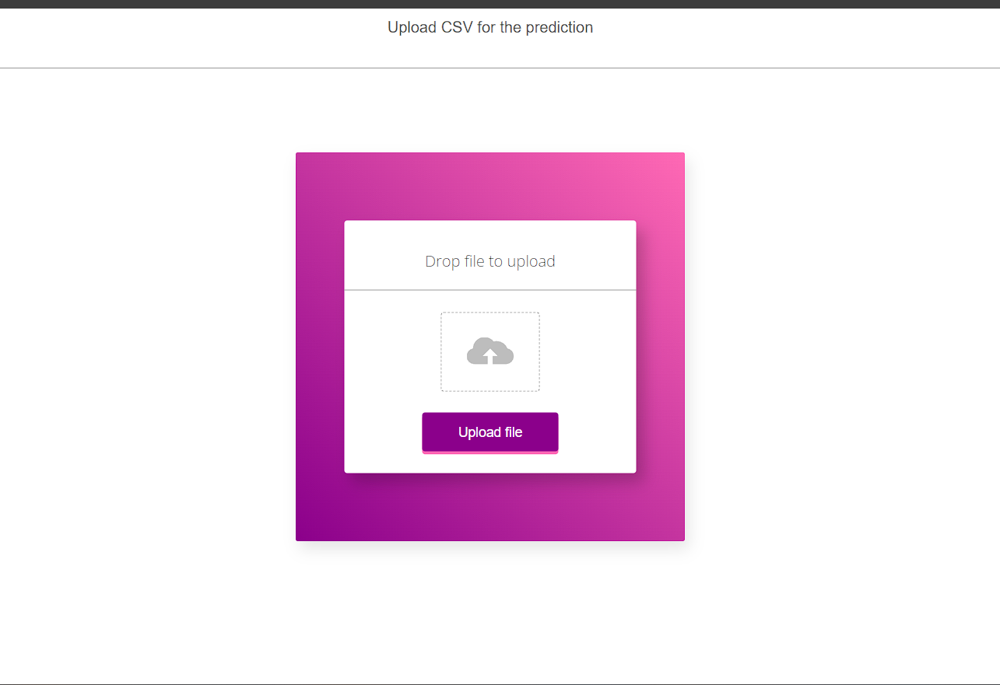

# End To End Heat-strock-prediction Project

## Project Overview
This project aims to develop a machine learning model to predict the likelihood of heart stroke based on patient health data (e.g., age, gender, hypertension, heart disease history, etc.). The goal is to provide early predictions to support healthcare professionals in preventing strokes through timely interventions. The project involves data preprocessing, model development, hyperparameter tuning, and deployment through MLOps tools.

## Problem Statement
Heart stroke is one of the leading causes of death worldwide. Early diagnosis of individuals at risk is critical in reducing mortality rates. This project uses machine learning to predict the chances of a heart stroke by analyzing various health-related attributes, enabling healthcare professionals to make data-driven, preventive decisions.


## Attribute Information
1) gender: "Male", "Female" or "Other"

2) age: age of the patient

3) hypertension: 0 if the patient doesn't have hypertension, 1 if the patient has hypertension

4) heart disease: 0 if the patient doesn't have any heart diseases, 1 if the patient has a heart disease 5) Ever-married: "No" or "Yes"

6) work type: "children", "Govtjov", "Never worked", "Private" or "Self-employed"

7) Residencetype: "Rural" or "Urban"

8) avg glucose level: average glucose level in blood

9) BMI: body mass index

10) smoking_status: "formerly smoked", "never smoked", "smokes" or "Unknown"*

11) stroke: 1 if the patient had a stroke or 0 if not

## Life Cycle 
*  Data Preprocessing: encoding, and normalizing health data to prepare it for machine learning models.
* Model Training: Building and training machine learning models such as Random Forest, XGBoost, and Logistic Regression to predict stroke risk.
* Hyperparameter Tuning: Optimizing model performance through techniques like Grid Search and Random Search.
* MLOps Deployment: Containerizing and deploying the model using Docker, automating updates via CI/CD pipelines, and tracking model performance with MLflow.
* Model Monitoring: Continuous tracking of model performance and retraining as new data becomes available.
* Model Deploy: AWS Beanstalk for web app hosting

## How to run ?

### create Env
```bash
conda create -p env python==3.9 -y
```

```bash
conda activate ./env
```

### Install Depndancies
```bash
pip install -r requirements.txt
```

### Setup Mongodb Atlas Database
```bash
 create .env file 
 url=''
 db=''
 collection=''
```
### Run Flask App
```bash
python app.py
```

### For csv file prediction
```
localhost:5000/predict
```

